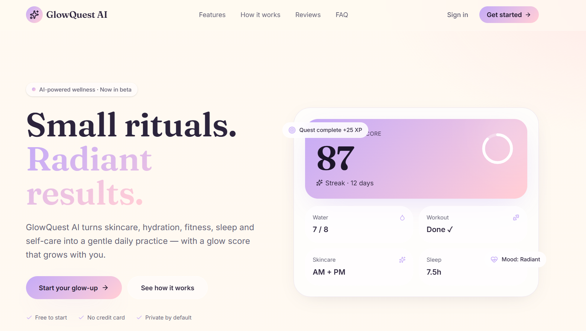
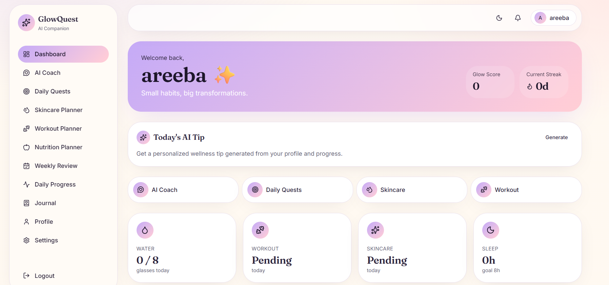
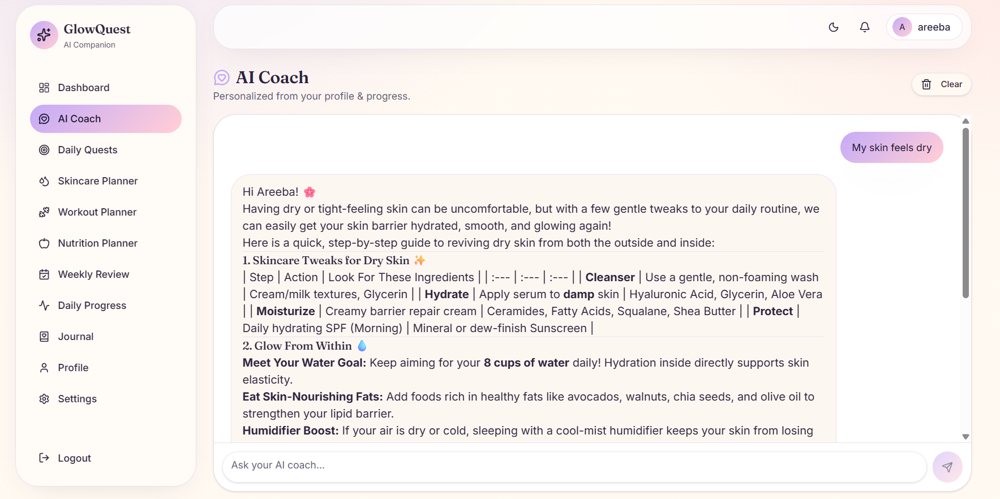

# 🌸 GlowQuest AI

> Your personal AI-powered wellness and glow-up coach — skincare, fitness, nutrition, sleep and healthy habits, all in one beautiful app.


---

## Tagline

*Track your habits. Talk to your coach. Watch yourself glow.*

## Problem

Most wellness apps are either siloed (only skincare, only workouts) or overwhelming (generic content that ignores who you actually are). People give up because plans don't fit their skin, budget, time, or lifestyle.

## Solution

**GlowQuest AI** combines a delightful habit tracker with a specialized AI coach that is *only* trained to talk about wellness — using your real onboarding data (goals, skin type, experience, available time, budget) to generate genuinely personalized plans, quests and reviews.

---

## Features

- Full authentication — sign up, sign in, forgot & reset password (Supabase Auth)
- 6-step onboarding — personal info, fitness goal, skin concerns, lifestyle, budget & time
- Premium dashboard — animated Glow Ring, weekly Recharts, streaks, AI tip of the day
- Daily progress tracker — water, workout, skincare, sleep with instant Glow Score recompute
- Journal — full CRUD entries with mood, energy and notes
- Dark mode, glassmorphism, feminine design system
- Responsive mobile-first layout with sidebar + sheet navigation

## AI Features

(Google Gemini via Lovable AI Gateway)

- AI Coach — streaming chat that stays strictly in-character as a wellness coach
- Skincare Planner — routines tailored to skin type, concerns and budget
- Workout Planner — weekly plans matched to experience and available time
- Nutrition Planner — realistic meal plans based on budget and goals
- Daily Glow Quests — personalized XP-earning micro-tasks
- Weekly Review — narrative summary of progress with next-week focus
- Journal Insights — gentle patterns discovered from recent journal entries

## Architecture

- **TanStack Start (React 19 + Vite 7)** — SSR, file-based routing, server functions
- **Supabase** — Postgres, Authentication and Row-Level Security
- **Lovable AI Gateway** — Google Gemini access without exposing API keys
- **shadcn/ui + Tailwind CSS v4** — accessible UI components and design tokens
- **Server Functions** for AI generation
- **Streaming API Route** for real-time AI chat

## Folder Structure

```text
src/
├── components/           # shadcn UI + shared components
├── hooks/                # Custom React hooks
├── integrations/supabase # Generated Supabase client
├── lib/                  # AI, utilities, glow score logic
├── routes/
│   ├── __root.tsx
│   ├── index.tsx
│   ├── auth.tsx
│   ├── reset-password.tsx
│   ├── _authenticated/
│   └── api/chat.ts
└── styles.css

supabase/
```

## Tech Stack

- TanStack Start
- React 19
- TypeScript
- Tailwind CSS v4
- shadcn/ui
- Supabase (Postgres, Authentication, RLS)
- Google Gemini via Lovable AI Gateway
- React Hook Form
- Zod
- Recharts
- Lucide React
- Sonner
- react-markdown

## Supabase Setup

Tables (all protected with Row-Level Security using `auth.uid()`):

- `profiles`
- `daily_progress`
- `journal`
- `ai_conversations`
- `saved_skincare_plans`
- `saved_workout_plans`
- `saved_nutrition_plans`
- `daily_glow_quests`
- `weekly_reviews`

Each public table includes appropriate RLS policies, permissions and automatic `updated_at` triggers.

## Gemini Setup

GlowQuest AI accesses Google Gemini through the **Lovable AI Gateway**, so you don't need to manage a Google API key directly.

If self-hosting, replace the gateway implementation in `src/lib/ai.server.ts` with the official `@google/generative-ai` SDK and configure `GEMINI_API_KEY`.

## Environment Variables

### Server

```env
LOVABLE_API_KEY=...
SUPABASE_URL=...
SUPABASE_PUBLISHABLE_KEY=...
SUPABASE_SERVICE_ROLE_KEY=...
```

### Client

```env
VITE_SUPABASE_URL=...
VITE_SUPABASE_PUBLISHABLE_KEY=...
VITE_SUPABASE_PROJECT_ID=...
```

## Installation

```bash
git clone <your-repository>
cd glowquest-ai
bun install
```

or

```bash
npm install
```

## Running Locally

```bash
bun run dev
```

Application runs at:

```
http://localhost:8080
```

## Deployment

Deploy to Vercel, Netlify or Cloudflare Workers.

### Vercel

1. Push the repository to GitHub.
2. Import the repository into Vercel.
3. Add the required environment variables.
4. Build command:

```bash
bun run build
```

Framework detection is automatic.

### Screenshots

### Landing Page



### Dashboard



### AI Coach




## Future Improvements

- Push notifications for daily quests
- Apple Health & Google Fit integration
- Community challenges
- Skin progress photo tracking
- Multi-language support

## License

MIT License

## Author

Built with love.
